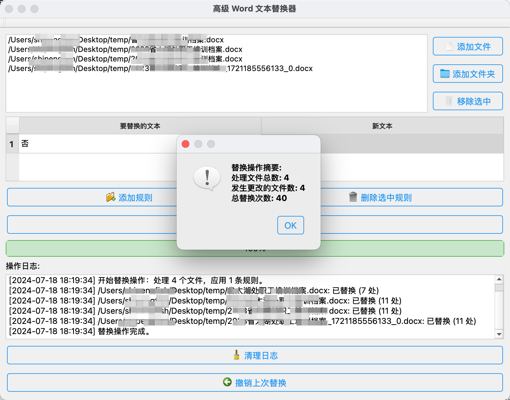

## Multiple Word Documents Replacement 

## 多个 word 文件文字替换工具

## 起因

亲妹有许多 word 文件需要替换其中的内容，她上网搜出来的方法是一个个 word 打开进行替换，问我有没有什么快速的方法。

我想起来我也从来没有批量替换多个 word 的经历，我也是一个个 word 打开进行替换的，如果是其他 text、markdown 文件，那么一些开发 IDE 可以轻易做到。

可是 word 文档的话，那些 IDE 工具也无法打开替换啊？

于是上网搜了几个工具，发现市面上还是存在这类工具的，比如 [Batch Word Replace](https://windows.dailydownloaded.com/zh/business-software/word-processing-software/62774-batch-word-replace-download-install/links)
但是这个工具处理几十 k 的文件就超出限制，需要购买才能使用，于是我在想能否自己写一个。

## 经过

完整的经过就是咨询 GPT

1. GPT 给了我一段 python 脚本，我在电脑上执行 python 脚本，确实能够替换
2. 运行完脚本后，我觉得光有脚本不够行，很多人根本不知道怎么运行这些脚本，并且这些脚本依赖开发环境
3. 继续追问 GPT，希望可以将脚本打包成 windows、mac 可用的执行文件
4. GPT 推荐我使用 pyinstaller 进行打包，将 python 的环境一并打包
5. 打包之后，得到可执行文件，这样就不需要依赖 python 了
6. 打开可执行文件，界面是命令行样式的，对于有开发经验的人来说还好，但是对于普通用户看到这种界面就害怕了
7. 继续追问，让 GPT 给出完善的界面，并且追加了一些功能

最终的界面如下：

## 主要功能有：

1. 自由选择需要替换的 word 文件/文件夹
2. 支持拖拽文件、文件夹
3. 支持批量移除 word 文件
4. 支持重复文件去重
5. 自定义替换规则，支持规则组
6. 支持替换进度条显示
7. 支持显示替换记录
8. 支持撤销替换
9. 支持操作日志、日志清理
10. 支持变更详情
11. 支持右键移除、跳转到资源文件

## 开发过程

1. 安装 python
2. 安装需要的依赖 `pip3 install PyQt6 python-docx pyinstaller`
3. 开发脚本 [advanced-word-replacer-app.py](source%2Fadvanced-word-replacer-app.py) 、[Word_Replacer.spec](source%2FWord_Replacer.spec)
4. 下载需要的图标[Free Simple Line Iconpack (50 icons) | Just Icon](https://www.iconarchive.com/show/free-simple-line-icons-by-justicon.html)
5. 将图标转为 icon [PNG to ICNS | CloudConvert](https://cloudconvert.com/png-to-icns)
6. 将上述文件放在同一个文件夹下，然后在这个目录下，执行打包脚本 `python3 -m PyInstaller Word_Replacer.spec`
7. 打包之后的可执行文件在同目录的 dist 文件夹下，双击即可运行

## 如何使用

下载 `Word Replacer.zip` 解压得到 `Word Replacer.exe` 或者 `Word Replacer.app` 执行文件，双击运行即可

### 最后感慨一句，GPT 真是牛逼，是这个时代最好的武器